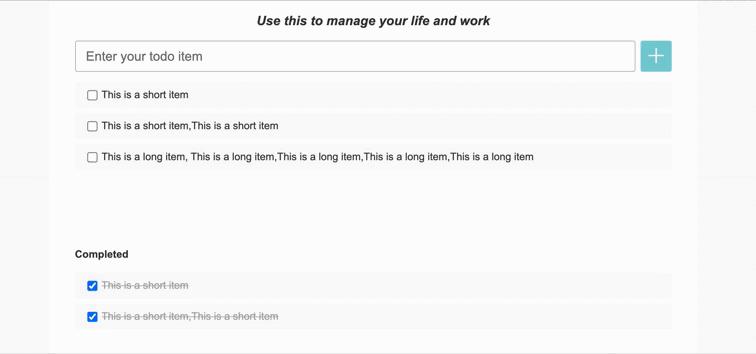

## 需求说明

### Story 1 显示 Task 列表

作为一个用户，我应当能看到已经添加过的 Task，包括 Todo 列表和 Completed 列表。  
若 Task Items 较多，则会出现纵向滚动条。 效果如下：

### Story 2 添加 Task

作为一个用户，我应当能够添加 Task。这样我就可以创建待办事项列表了。

#### AC 1 添加 Task

* 当用户在输入框输入内容之后，点击 “+” 按钮可以在 Todo 列表中第一个位置添加一个新的 item。
* 当新的 task 添加完成之后，应当清空输入框中的文字。

### Story 3 删除待办事项

作为一个用户，我希望能够删除不需要的 Task

#### AC 1 删除未完成的 Task item

* 当鼠标放在 Todo task item 上时，显示"删除"按钮，点击"删除"按钮，该条 item 从列表消失。

#### AC 1 删除已完成的 Task item

* 当鼠标放在 Completed task item 上时，显示"删除"按钮，点击"删除"按钮，该条 item 从列表消失。

### Story 4 标记完成状态

作为一个用户，当我变更 Task 状态的时候，希望能够明显的观察到他们的位置变化，这样我更容易看清整体的任务情况。

#### AC 1 完成状态的显示与切换

* 当一个 Todo task item 被标记为完成状态（checkbox 被勾选）的时候，item 应该从 Todo List 移除，并且出现在 Completed List。
* 当一个 Todo task item 被重新激活（checkbox 取消勾选）的时候，item 应该从 Completed List 移除，并且出现在 Todo List。

### Story 5 修改 Item 内容

作为一个用户，我可以修改已经创建的 Item 内容。

#### AC 1 编辑完成

* 当鼠标点击 Item 内容区域，显示 input 输入框，自动focus，placeholder 为当前内容，用户可以输入新的内容，按 "回车键"，修改成功，显示新的内容，输入框消失。

#### AC 1 取消编辑

* 当鼠标点击 Item 内容区域，显示 input 输入框，自动focus，点击其他地方，输入框消失，原来 Item 内容不变。

